# devops-diplom-yandexcloud

# Дипломный практикум в Yandex.Cloud
  * [Цели:](#цели)
  * [Этапы выполнения:](#этапы-выполнения)
     * [Создание облачной инфраструктуры](#создание-облачной-инфраструктуры)
     * [Создание Kubernetes кластера](#создание-kubernetes-кластера)
     * [Создание тестового приложения](#создание-тестового-приложения)
     * [Подготовка cистемы мониторинга и деплой приложения](#подготовка-cистемы-мониторинга-и-деплой-приложения)
     * [Установка и настройка CI/CD](#установка-и-настройка-cicd)
  * [Что необходимо для сдачи задания?](#что-необходимо-для-сдачи-задания)
  * [Как правильно задавать вопросы дипломному руководителю?](#как-правильно-задавать-вопросы-дипломному-руководителю)

**Перед началом работы над дипломным заданием изучите [Инструкция по экономии облачных ресурсов](https://github.com/netology-code/devops-materials/blob/master/cloudwork.MD).**

---
## Цели:

1. Подготовить облачную инфраструктуру на базе облачного провайдера Яндекс.Облако.
2. Запустить и сконфигурировать Kubernetes кластер.
3. Установить и настроить систему мониторинга.
4. Настроить и автоматизировать сборку тестового приложения с использованием Docker-контейнеров.
5. Настроить CI для автоматической сборки и тестирования.
6. Настроить CD для автоматического развёртывания приложения.

---
## Этапы выполнения:


### Создание облачной инфраструктуры

Для начала необходимо подготовить облачную инфраструктуру в ЯО при помощи [Terraform](https://www.terraform.io/).

Особенности выполнения:

- Бюджет купона ограничен, что следует иметь в виду при проектировании инфраструктуры и использовании ресурсов;
Для облачного k8s используйте региональный мастер(неотказоустойчивый). Для self-hosted k8s минимизируйте ресурсы ВМ и долю ЦПУ. В обоих вариантах используйте прерываемые ВМ для worker nodes.

Предварительная подготовка к установке и запуску Kubernetes кластера.

1. Создайте сервисный аккаунт, который будет в дальнейшем использоваться Terraform для работы с инфраструктурой с необходимыми и достаточными правами. Не стоит использовать права суперпользователя
2. Подготовьте [backend](https://developer.hashicorp.com/terraform/language/backend) для Terraform:  
   а. Рекомендуемый вариант: S3 bucket в созданном ЯО аккаунте(создание бакета через TF)
   б. Альтернативный вариант:  [Terraform Cloud](https://app.terraform.io/)
3. Создайте конфигурацию Terrafrom, используя созданный бакет ранее как бекенд для хранения стейт файла. Конфигурации Terraform для создания сервисного аккаунта и бакета и основной инфраструктуры следует сохранить в разных папках.
4. Создайте VPC с подсетями в разных зонах доступности.
5. Убедитесь, что теперь вы можете выполнить команды `terraform destroy` и `terraform apply` без дополнительных ручных действий.
6. В случае использования [Terraform Cloud](https://app.terraform.io/) в качестве [backend](https://developer.hashicorp.com/terraform/language/backend) убедитесь, что применение изменений успешно проходит, используя web-интерфейс Terraform cloud.

Ожидаемые результаты:

1. Terraform сконфигурирован и создание инфраструктуры посредством Terraform возможно без дополнительных ручных действий, стейт основной конфигурации сохраняется в бакете или Terraform Cloud
2. Полученная конфигурация инфраструктуры является предварительной, поэтому в ходе дальнейшего выполнения задания возможны изменения.
---
У меня были проблемы с ansible на windows, поэтому переехал на ubuntu server

Структура проекта разделена на две папки:
- bootstrap - Cоздание сервисного аккаунта и бакета
- main - Основная инфраструктура (VPC, ВМ, K8s) / создаст inventory файл для поднятия Kubernetes кластера

Для запуска по кнопке сделал bash скрипт, который сделает всё.
setup.sh установит в cloud yandex всю инфру, затем через Kubespray установим Kubernetes кластер
Перед этим может потребоваться chmod +x setup.sh
```commandline
#!/bin/bash
set -e

if [ -n "$1" ]; then
    INVENTORY_PATH="$(realpath "$1")"
else
    INVENTORY_PATH="$(realpath "$(dirname "$0")/../diplom_ubuntu/main/inventory.ini")"
fi

echo "Using inventory: $INVENTORY_PATH"

SCRIPT_DIR="$(cd "$(dirname "${BASH_SOURCE[0]}")" && pwd)"
cd "$SCRIPT_DIR"

echo "=== Bootstrap phase ==="
cd bootstap
terraform init -reconfigure
terraform apply -auto-approve

export AWS_ACCESS_KEY_ID=$(terraform output -raw access_key)
export AWS_SECRET_ACCESS_KEY=$(terraform output -raw secret_key)

echo "=== Main phase ==="
cd ../main
terraform init -reconfigure
terraform apply -auto-approve

echo "=== Kubespray phase ==="
# Установка Ansible, если отсутствует
if ! command -v ansible >/dev/null 2>&1; then
  echo "Ansible not found, installing via apt..."
  sudo apt update && sudo apt install -y ansible
fi

cd
if [ ! -d "kubespray" ]; then
  git clone https://github.com/kubernetes-sigs/kubespray.git
fi
cd kubespray
python3 -m venv venv || true
source venv/bin/activate
pip install -r requirements.txt
ansible-playbook -i "$INVENTORY_PATH" cluster.yml -b -v

echo "Done."
```

Ключи для backend s3 передаю через
```commandline
export AWS_ACCESS_KEY_ID=$(terraform output -raw access_key)
export AWS_SECRET_ACCESS_KEY=$(terraform output -raw secret_key)
```

После запуска
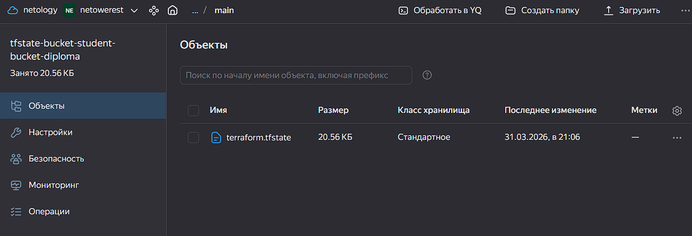

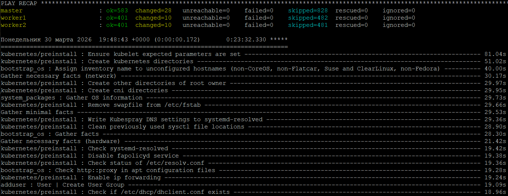
---
### Создание Kubernetes кластера

На этом этапе необходимо создать [Kubernetes](https://kubernetes.io/ru/docs/concepts/overview/what-is-kubernetes/) кластер на базе предварительно созданной инфраструктуры.   Требуется обеспечить доступ к ресурсам из Интернета.

Это можно сделать двумя способами:

1. Рекомендуемый вариант: самостоятельная установка Kubernetes кластера.  
   а. При помощи Terraform подготовить как минимум 3 виртуальных машины Compute Cloud для создания Kubernetes-кластера. Тип виртуальной машины следует выбрать самостоятельно с учётом требовании к производительности и стоимости. Если в дальнейшем поймете, что необходимо сменить тип инстанса, используйте Terraform для внесения изменений.  
   б. Подготовить [ansible](https://www.ansible.com/) конфигурации, можно воспользоваться, например [Kubespray](https://kubernetes.io/docs/setup/production-environment/tools/kubespray/)  
   в. Задеплоить Kubernetes на подготовленные ранее инстансы, в случае нехватки каких-либо ресурсов вы всегда можете создать их при помощи Terraform.
2. Альтернативный вариант: воспользуйтесь сервисом [Yandex Managed Service for Kubernetes](https://cloud.yandex.ru/services/managed-kubernetes)  
  а. С помощью terraform resource для [kubernetes](https://registry.terraform.io/providers/yandex-cloud/yandex/latest/docs/resources/kubernetes_cluster) создать **региональный** мастер kubernetes с размещением нод в разных 3 подсетях      
  б. С помощью terraform resource для [kubernetes node group](https://registry.terraform.io/providers/yandex-cloud/yandex/latest/docs/resources/kubernetes_node_group)
  
Ожидаемый результат:

1. Работоспособный Kubernetes кластер.
2. В файле `~/.kube/config` находятся данные для доступа к кластеру.
3. Команда `kubectl get pods --all-namespaces` отрабатывает без ошибок.
---
Нужно создать config кластера Kubernetes.
Подключаемся к master выполняем команды:
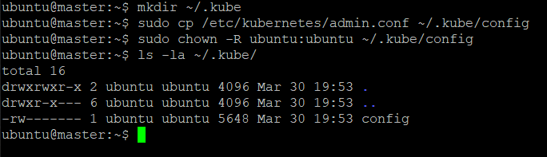

Папка для конфигурации создана, файл настроек скопирован и защищен правами.
Теперь проверяем работоспособность кластера: поды и ноды.
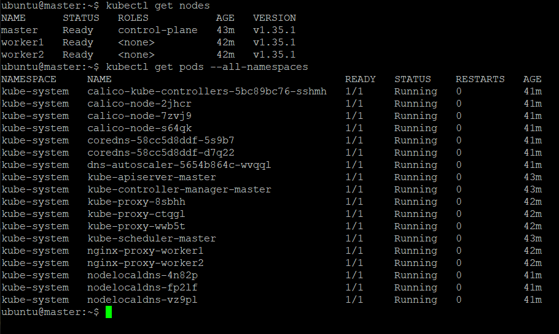

Все поды и ноды готовы к работе. Развертывание кластера Kubernetes завершено успешно.
---
### Создание тестового приложения

Для перехода к следующему этапу необходимо подготовить тестовое приложение, эмулирующее основное приложение разрабатываемое вашей компанией.

Способ подготовки:

1. Рекомендуемый вариант:  
   а. Создайте отдельный git репозиторий с простым nginx конфигом, который будет отдавать статические данные.  
   б. Подготовьте Dockerfile для создания образа приложения.  
2. Альтернативный вариант:  
   а. Используйте любой другой код, главное, чтобы был самостоятельно создан Dockerfile.

Ожидаемый результат:

1. Git репозиторий с тестовым приложением и Dockerfile.
2. Регистри с собранным docker image. В качестве регистри может быть DockerHub или [Yandex Container Registry](https://cloud.yandex.ru/services/container-registry), созданный также с помощью terraform.

- [Git](https://github.com/Werest/test-app)


---
### Подготовка cистемы мониторинга и деплой приложения

Уже должны быть готовы конфигурации для автоматического создания облачной инфраструктуры и поднятия Kubernetes кластера.  
Теперь необходимо подготовить конфигурационные файлы для настройки нашего Kubernetes кластера.

Цель:
1. Задеплоить в кластер [prometheus](https://prometheus.io/), [grafana](https://grafana.com/), [alertmanager](https://github.com/prometheus/alertmanager), [экспортер](https://github.com/prometheus/node_exporter) основных метрик Kubernetes.
2. Задеплоить тестовое приложение, например, [nginx](https://www.nginx.com/) сервер отдающий статическую страницу.

Способ выполнения:
1. Воспользоваться пакетом [kube-prometheus](https://github.com/prometheus-operator/kube-prometheus), который уже включает в себя [Kubernetes оператор](https://operatorhub.io/) для [grafana](https://grafana.com/), [prometheus](https://prometheus.io/), [alertmanager](https://github.com/prometheus/alertmanager) и [node_exporter](https://github.com/prometheus/node_exporter). Альтернативный вариант - использовать набор helm чартов от [bitnami](https://github.com/bitnami/charts/tree/main/bitnami).
---
Чтобы управлять кластером удобнее, скопирую файл конфигурации на свой компьютер и обновлю в нем IP-адрес. 

Забираю config - scp ubuntu@<master_ip>:.kube/config ~/.kube/config

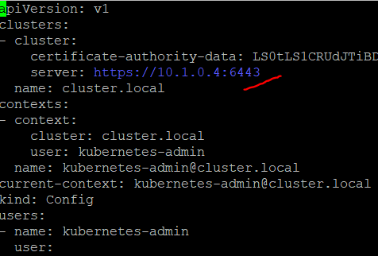
Бывает ещё так, что
```
kubectl get nodes
E0330 20:10:09.528906    1732 memcache.go:265] "Unhandled Error" err="couldn't get current server API group 
list: Get \"https://93.77.185.179:6443/api?timeout=32s\": tls: failed to verify certificate: x509: 
certificate is valid for 10.233.0.1, 10.1.0.4, 127.0.0.1, ::1, not 93.77.185.179"
Ошибка говорит о том, что сертификат API-сервера Kubernetes не включает публичный IP-адрес 93.77.185.179. 
В сертификате указаны только внутренние адреса кластера и 127.0.0.1. 
Поэтому при подключении с внешней машины проверка подлинности сервера не проходит.
```
Тогда решение
```
kubectl -n kube-system get cm kubeadm-config -o jsonpath='{.data.ClusterConfiguration}' > kubeadm-config.yaml
sudo mv /etc/kubernetes/pki/apiserver.crt /etc/kubernetes/pki/apiserver.crt.bak
sudo mv /etc/kubernetes/pki/apiserver.key /etc/kubernetes/pki/apiserver.key.bak
sudo kubeadm init phase certs apiserver --config=kubeadm-config.yaml
sudo cat /etc/kubernetes/admin.conf > ~/.kube/config
# local
chmod 600 ~/.kube/config
```
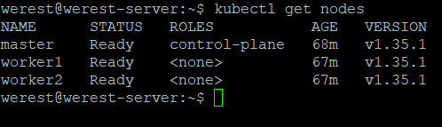

### Установка kube-prometheus-stack
```
helm repo add prometheus-community https://prometheus-community.github.io/helm-charts
helm repo update

helm install monitoring prometheus-community/kube-prometheus-stack \
--namespace monitoring \
--create-namespace \
--set grafana.service.type=NodePort \
--set grafana.service.nodePort=30080

kubectl get secret -n monitoring monitoring-grafana -o jsonpath="{.data.admin-password}" | base64 --decode ; echo
kubectl get svc -n monitoring monitoring-grafana
```
Получаем пароль к grafana
```
kubectl get secret -n monitoring monitoring-grafana -o jsonpath="{.data.admin-password}" | base64 --decode ; echo
```

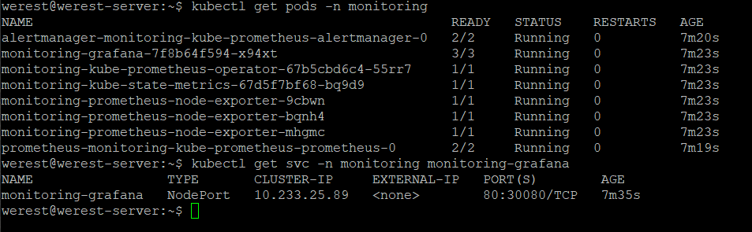

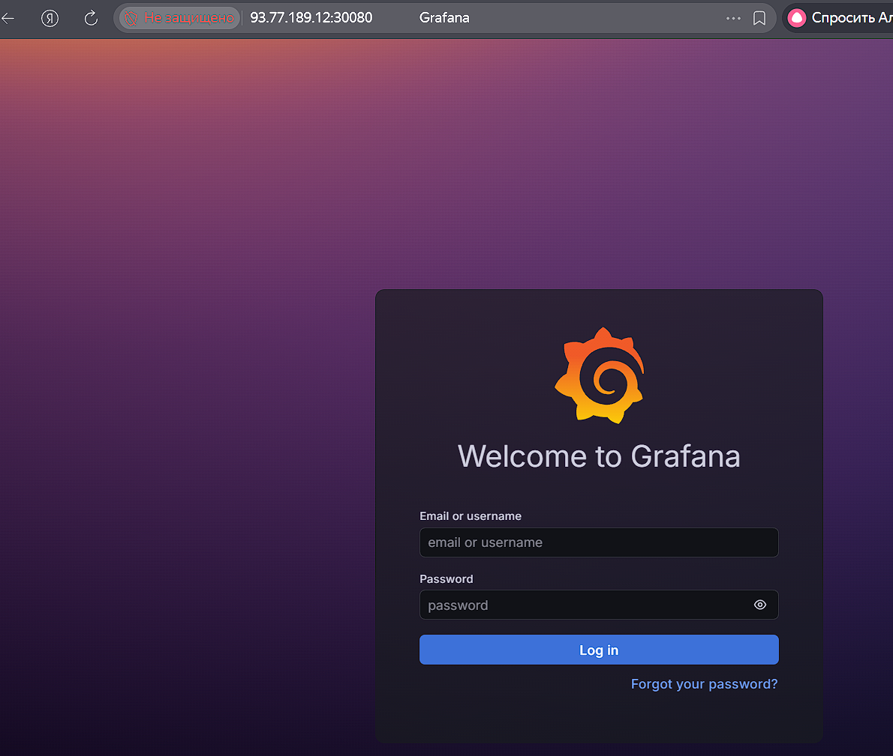

## Деплой приложения kubectl apply -f
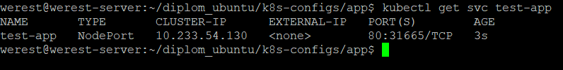

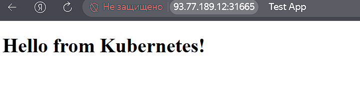

[GitHub - приложения](https://github.com/Werest/test-app)
---
### Деплой инфраструктуры в terraform pipeline

1. Если на первом этапе вы не воспользовались [Terraform Cloud](https://app.terraform.io/), то задеплойте и настройте в кластере [atlantis](https://www.runatlantis.io/) для отслеживания изменений инфраструктуры. Альтернативный вариант 3 задания: вместо Terraform Cloud или atlantis настройте на автоматический запуск и применение конфигурации terraform из вашего git-репозитория в выбранной вами CI-CD системе при любом комите в main ветку. Предоставьте скриншоты работы пайплайна из CI/CD системы.

Ожидаемый результат:
1. Git репозиторий с конфигурационными файлами для настройки Kubernetes.
2. Http доступ на 80 порту к web интерфейсу grafana.
3. Дашборды в grafana отображающие состояние Kubernetes кластера.
4. Http доступ на 80 порту к тестовому приложению.
5. Atlantis или terraform cloud или ci/cd-terraform
---
После создания сервисного аккаунта повторно может возникнуть ошибка
Service account 'aje27102e538kndc7k9h' already exists
Поэтому однажды создаем сервисный аккаунт
Записываем в секреты access_key и secret_key

И запускаем создание 1 master и 2 worker.
Поднятие Kubernetes происходит через Kuberspray + inventory.ini + kube-prometheus-stack

После отработки CICD будет поднят Kubernetes кластер
В целях безопасности захожу на master копирую пароль grafana и .kube/config для test-app
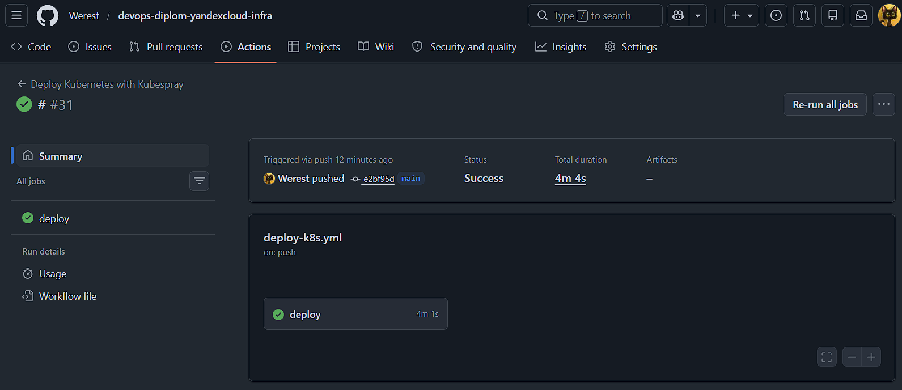

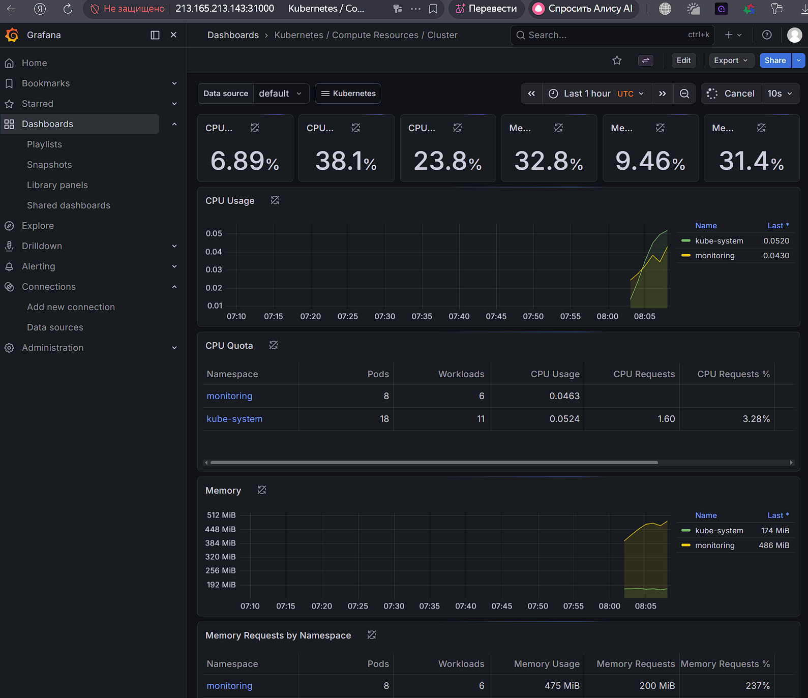

Переходим в репозиторий приложения
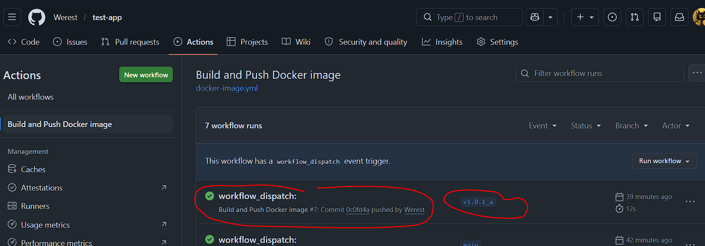

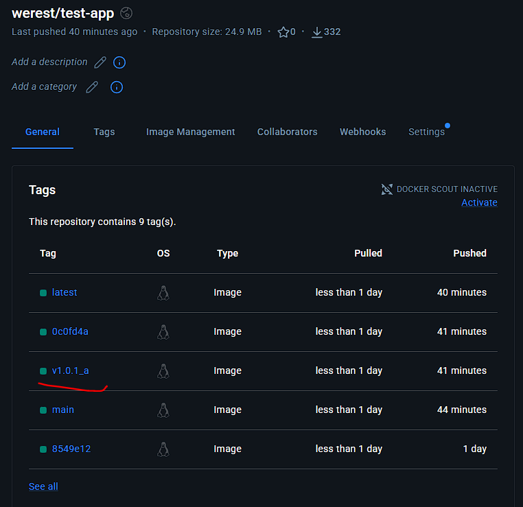

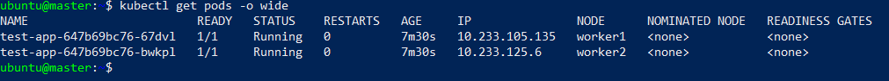

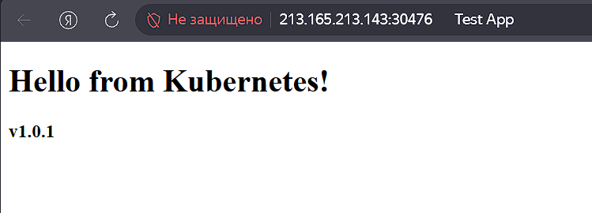

Теперь чтобы приложение было доступно на 80 порту, нужно создать LoadBalancer в развертывании инфры
Grafana собирается так (nodePort 31000):
```
      - name: Deploy kube-prometheus-stack
        run: |
          helm repo add prometheus-community https://prometheus-community.github.io/helm-charts
          helm repo update
          helm upgrade --install monitoring prometheus-community/kube-prometheus-stack \
            --namespace monitoring \
            --create-namespace \
            --set grafana.service.type=NodePort \
            --set grafana.service.nodePort=31000
```
Нацелим балансировщик на порт 31000
А у приложения на 32000
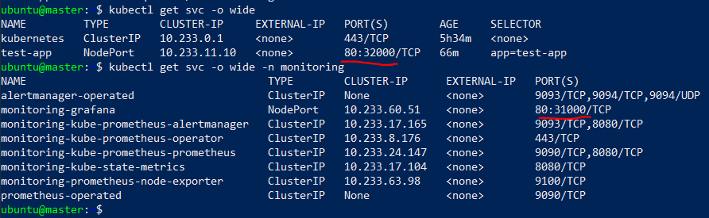

LB подняты для APP и Grafana:
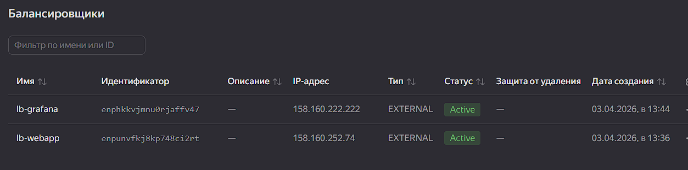

### Приложение
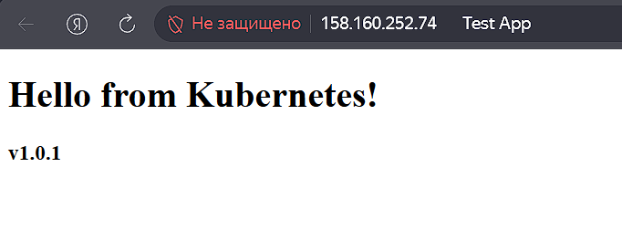

### Grafana
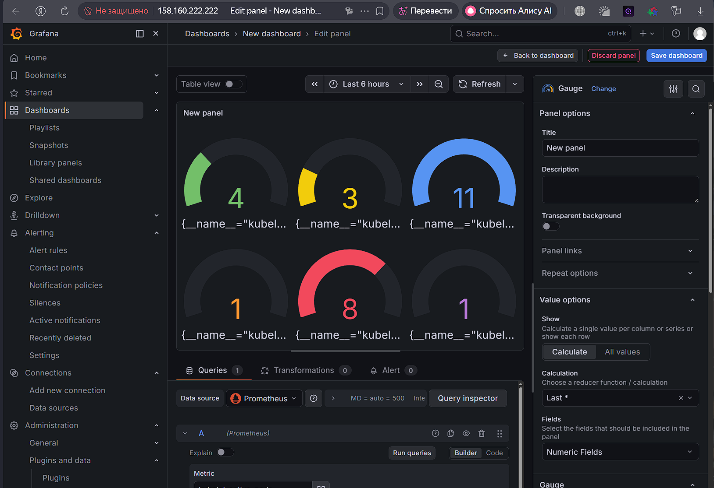

Удалить ресурсы можно через ручной запуск workflow:

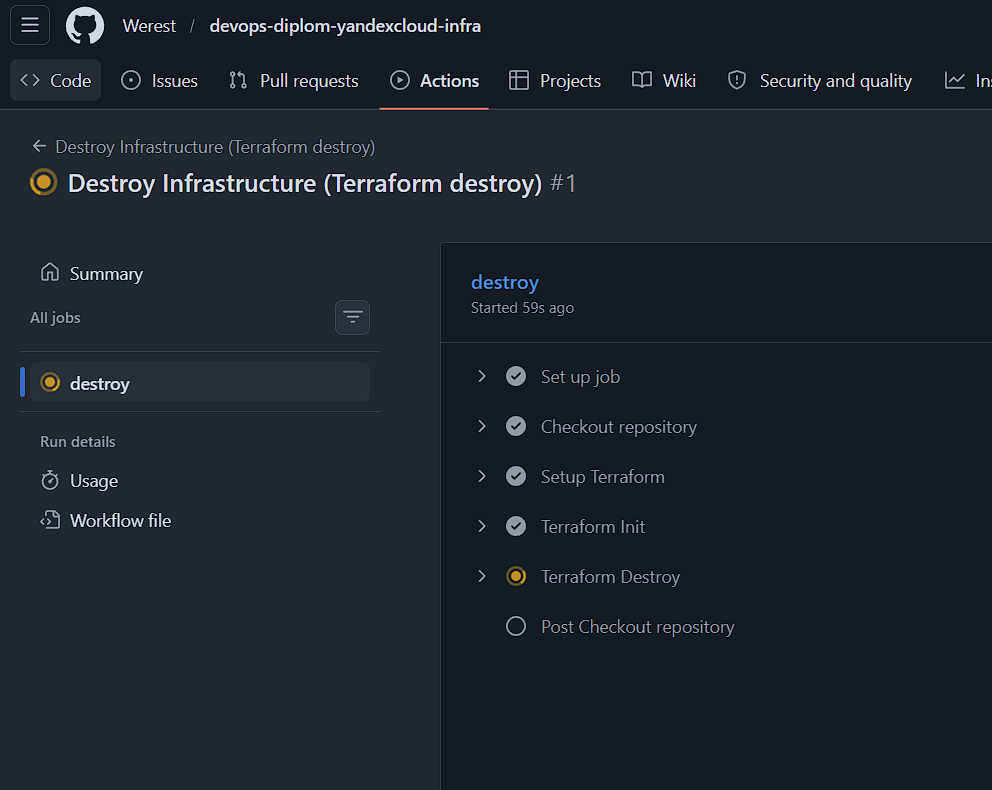

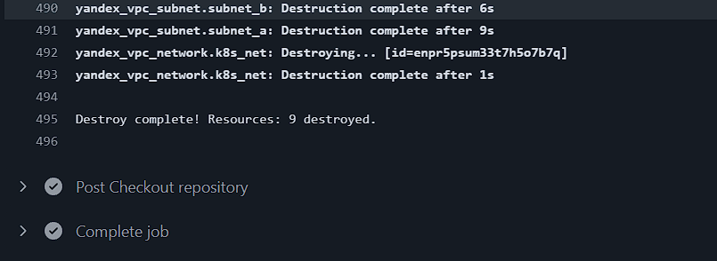

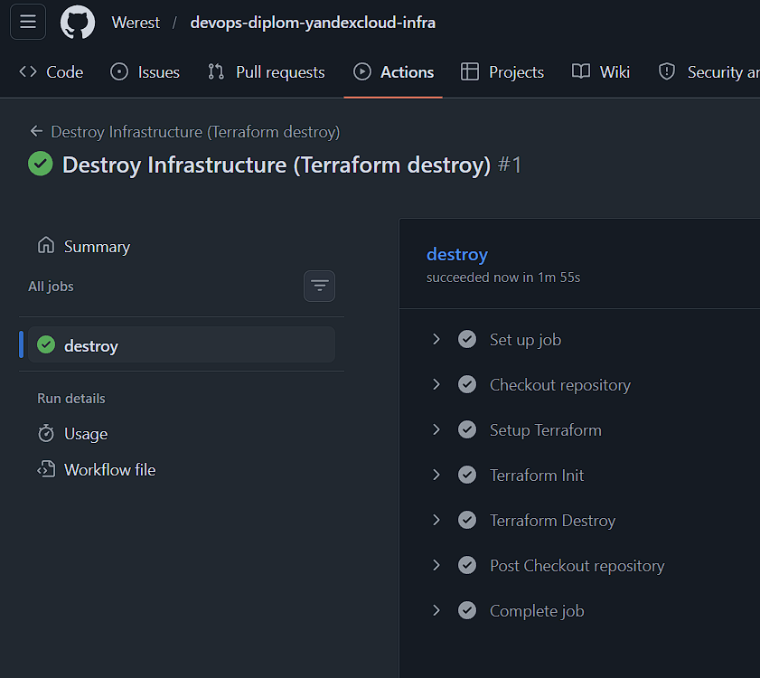
---
### Установка и настройка CI/CD

Осталось настроить ci/cd систему для автоматической сборки docker image и деплоя приложения при изменении кода.

Цель:

1. Автоматическая сборка docker образа при коммите в репозиторий с тестовым приложением.
2. Автоматический деплой нового docker образа.

Можно использовать [teamcity](https://www.jetbrains.com/ru-ru/teamcity/), [jenkins](https://www.jenkins.io/), [GitLab CI](https://about.gitlab.com/stages-devops-lifecycle/continuous-integration/) или GitHub Actions.

Ожидаемый результат:

1. Интерфейс ci/cd сервиса доступен по http.
2. При любом коммите в репозиторие с тестовым приложением происходит сборка и отправка в регистр Docker образа.
3. При создании тега (например, v1.0.0) происходит сборка и отправка с соответствующим label в регистри, а также деплой соответствующего Docker образа в кластер Kubernetes.
---
[GitHub - приложения](https://github.com/Werest/test-app)

[Установка и настройка CI/CD для приложения через Github Actions](https://github.com/Werest/test-app/actions/workflows/docker-image.yml)

Docker hub
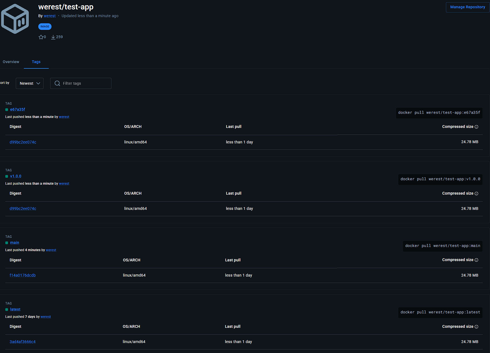
Github Actions при коммите в main и при создании tag v1.0.0
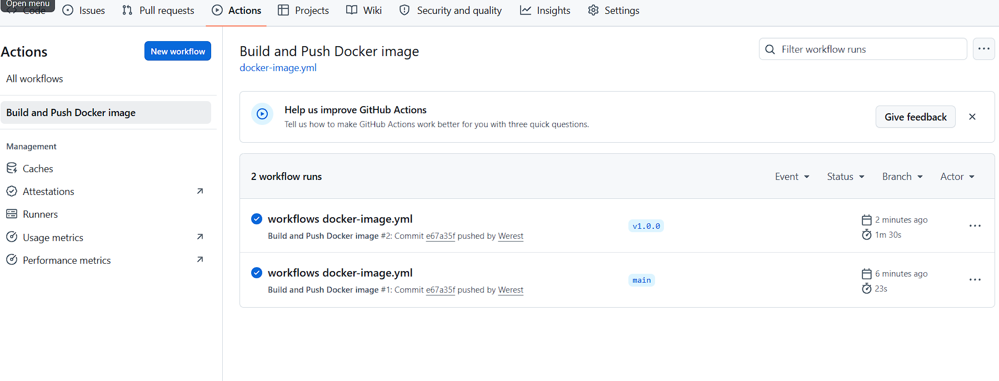

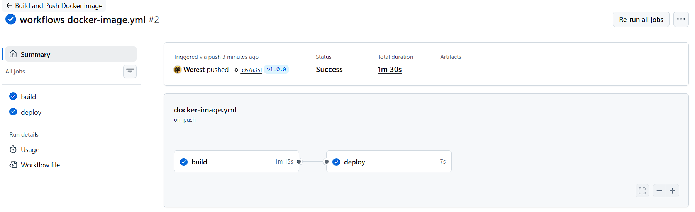

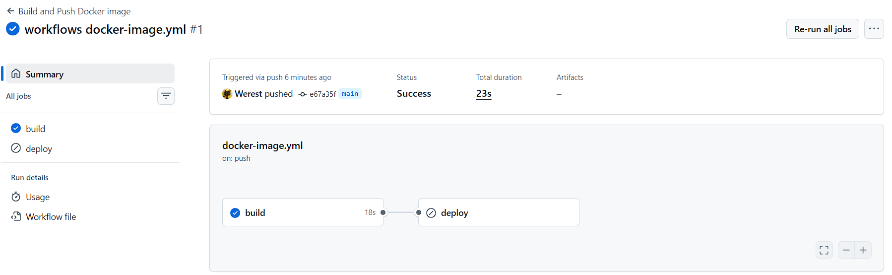

### До тега:
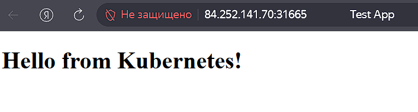
### С тегом 1.0.1:
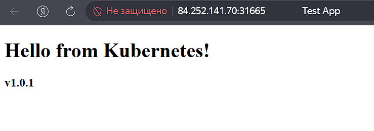
---
# Ссылки
Инфра - https://github.com/Werest/devops-diplom-yandexcloud-infra

Приложение - https://github.com/Werest/test-app
---
## Что необходимо для сдачи задания?

1. Репозиторий с конфигурационными файлами Terraform и готовность продемонстрировать создание всех ресурсов с нуля.
2. Пример pull request с комментариями созданными atlantis'ом или снимки экрана из Terraform Cloud или вашего CI-CD-terraform pipeline.
3. Репозиторий с конфигурацией ansible, если был выбран способ создания Kubernetes кластера при помощи ansible.
4. Репозиторий с Dockerfile тестового приложения и ссылка на собранный docker image.
5. Репозиторий с конфигурацией Kubernetes кластера.
6. Ссылка на тестовое приложение и веб интерфейс Grafana с данными доступа.
7. Все репозитории рекомендуется хранить на одном ресурсе (github, gitlab)
